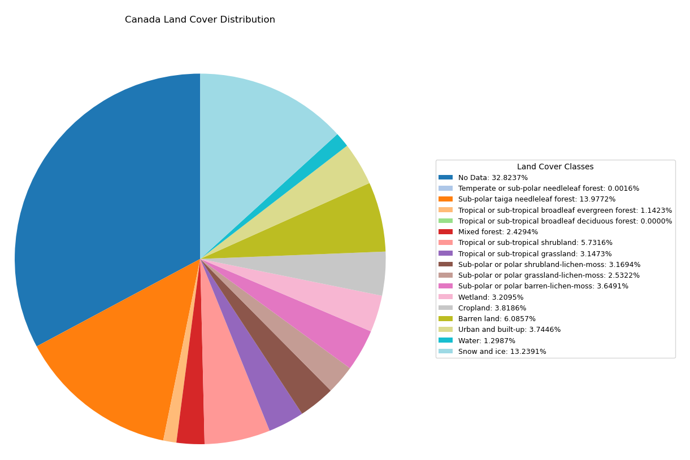

# Satellite STAC Downloader

This repository generates random bounding boxes in Canada and downloads **RCM-ARD** imagery at **256×256 pixels** with **20m resolution**. 

In addition to the RCM data, it also downloads:

- **Landcover data**
- **Metadata**:
  - Province
  - Census Division
  - Census Subdivision

A web-based visualization of 1000 example bounding boxes and metadata downloaded using this tool is available here:  
[https://jeremy-costello.github.io/sat-stac-dl/](https://jeremy-costello.github.io/sat-stac-dl/)

**NOTE:** you may have to hard refresh for the base map tiles to appear.
  - Shift + F5 on Chrome
  - Ctrl + Shift + R on Firefox

## Features

- Generates various lat/long coordinates within Canada.
  - can be from across provinces, census divisions, census subdivisions, or completely random
- Fetches RCM-ARD imagery using STAC APIs.
- Fetches associated landcover data.
- Extracts metadata from shapefiles for provinces, census divisions, and subdivisions.
- Stores results in a database and optionally as GeoTIFFs.

## Data Sample and Metadata Visualization
I randomly sampled 5 bboxes from each census subdivision, 100 bboxes from each census division, 5000 bboxes from each province, and 250000 bboxes from the extents of Canada. This resulted in 370,105 bboxes.

### Land Cover Distribution
Shown below is the land cover distribution of these bboxes from the 2020 Land Cover of Canada.

### Province Distribution
Shown below is the province distribution of these bboxes from the 2021 Census of Canada.

### Census Divisions
Shown below are the top 20 census divisions of these bboxes from the 2021 Census of Canada.

### Census Subdivisions
Shown below are the top 20 census subdivisions of these bboxes from the 2021 Census of Canada.

### Datetime Distribution
Shown below is the datetime distribution of collection items represented in the data sample.

